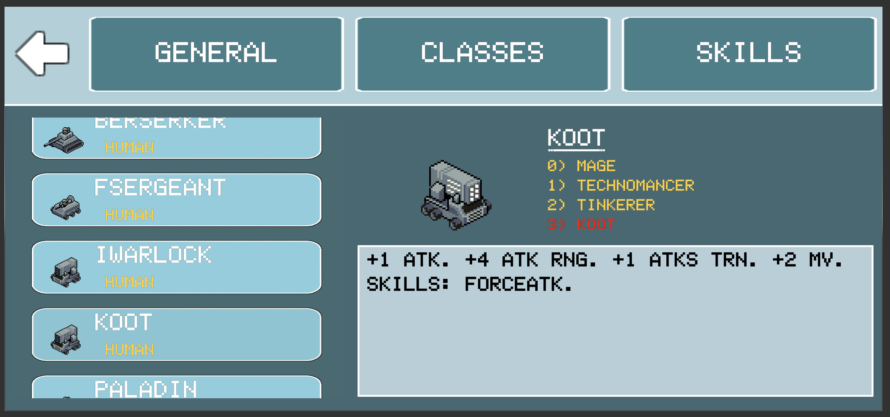

## Elder's Quest
Iso quest game

## App Links
https://play.google.com/store/apps/details?id=com.DarkSheep.MysticalQ
https://blacksheepstudios.itch.io/elders-tale

## Screens (Alpha v.48)

## Screens (Alpha v.28)

## Screens (Alpha v.07)

#### license

MIT. Copyright (c) Brad Z
